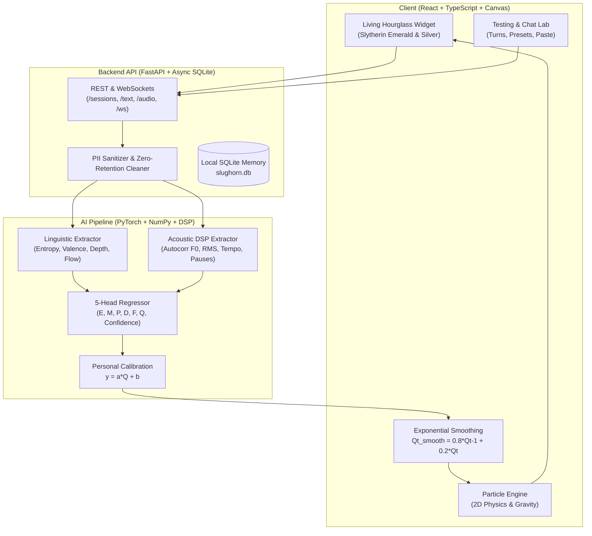

# 🐍 Slughorn’s Hourglass: Ambient Multimodal Conversation AI

<div align="center">

```
             .--------------------------------------------.
            /  "The sand runs according to the quality    \
           |   of the conversation. If it is stimulating,  |
            \   the sand runs very slowly indeed..."      /
             '--------------------------------------------'
                                     — Professor Horace Slughorn
                                       (Harry Potter and the Half-Blood Prince)
```

[](https://fastapi.tiangolo.com)
[](https://pytorch.org)
[](https://reactjs.org)
[](https://tailwindcss.com)
[](LICENSE)

*An ambient, cross-platform multimodal AI simulation widget that listens to conversation in real-time, estimates emotional depth, mutual connection, and engagement, and physically slows down time.*

</div>

---

## 📜 Lore & The Concept

In the Harry Potter universe, **Professor Horace Slughorn**—former Head of Slytherin House and Potions Master—kept a renowned, ornate hourglass in his office. Unlike mundane Muggle sandglasses that tick away uniformly, Slughorn's hourglass was enchanted:

> *When a conversation was dull, repetitive, or superficial, the green sand plummeted rapidly. But when the discourse was witty, stimulating, mutually vulnerable, and deeply meaningful, the sand slowed to a near-halt, granting its participants the illusion of suspended time.*

**Slughorn’s Hourglass AI** realizes this magical artifact as a modern software-first, privacy-preserving multimodal AI system.

```
       .────────────────────────.
      /   ▲  ▲  ▲  ▲  ▲  ▲  ▲    \
     |   [ DISCONNECTED / DULL ]  |  ──> Fast falling sand, dim grey-green tint (2.2x speed)
      \                          /
       \         Neck           /
       /                        \
      /    [ MEANINGFUL CONVO ]   \  ──> Slower sand, glowing emerald & amber trails (0.25x speed)
     |    ✦   ✦   ✦   ✦   ✦   ✦   |
     |     [ DEEP MOMENTS ]       |  ──> Suspended particles, anti-gravity upward float (0.05x speed)
      \                          /
       '────────────────────────'
```

---

## ⚡ Key Features

* **🔮 Real-Time Ambient Simulation Widget:**
  * Frameless glassmorphic particle simulation rendering up to 300 dynamic sand grains.
  * Custom 2D physics engine: constriction funnel throttling, sand mound accumulation, angle of repose, glowing particle trails, and **anti-gravity upward suspension during deep moments**.
* **🧠 Multimodal AI Scoring Pipeline:**
  * **Acoustic Branch (How it's said):** Normalized autocorrelation pitch ($F_0$), RMS energy loudness, speaking rate/tempo, pause ratios, spectral centroid, and zero-crossing rate.
  * **Linguistic Branch (What's said):** Shannon entropy turn-taking balance, question curiosity, follow-up detection, reflective disclosure density, and semantic cohesion.
* **⚡ 5 Multidimensional Quality Prediction Heads:**
  * $E$ = **Engagement** (Curiosity, active listening, response detail)
  * $M$ = **Mutuality** (Equal participation, balanced speaking turns)
  * $P$ = **Positivity** (Emotional warmth, humor, support vs. tension)
  * $D$ = **Depth** (Personal reflection, storytelling, abstract ideas)
  * $F$ = **Flow** (Continuity, semantic bridges, lack of repetitive loops)
  $$\mathbf{Q} = 0.30E + 0.25M + 0.20P + 0.15D + 0.10F$$
* **🛡️ Recency-Weighted Adaptive Shift Engine:**
  * Exponential sliding window ($\gamma = 0.75$) detects dynamic atmospheric shifts (e.g. heated friction $\to$ apology/reconciliation $\to$ resumed tension).
  * Tiered hostility tokens vs. safe context parsing (words like *"ignored"* or *"tired"* never falsely trigger conflict).
* **🧙‍♂️ Personal Calibration Loop (Slughorn's Memory Vial):**
  * Online L2-regularized linear feedback calibration ($y = a \cdot Q + b$) adapts future predictions to your individual conversational style.
* **🏰 House Slytherin Aesthetic:**
  * Deep dungeon obsidian (`#040906`), polished platinum silver borders (`#C8D1CC`), luminescent emerald glow (`#10B981`), and antique gold highlights (`#D4AF37`).
* **🔒 Zero-Retention Privacy Protocol:**
  * Audio chunks are analyzed strictly in volatile memory and wiped immediately. Zero private audio is saved without consent.

---

## 🪐 Visual State Mapping

| AI State | Visual Atmosphere | Sand Speed | Particle Physics Behavior |
| :--- | :--- | :--- | :--- |
| **Disconnected** | Dim grey-green (`#6B7280`) | **$2.2\times$ Fast** | Rapid vertical drop, scattered heap, no glow |
| **Neutral** | Soft pale sage (`#86EFAC`) | **$1.0\times$ Normal** | Standard steady stream, standard mound |
| **Engaged** | Bright emerald green (`#10B981`) | **$0.6\times$ Slow** | Controlled stream, glowing particle trails |
| **Meaningful** | Warm golden amber (`#F59E0B`) | **$0.25\times$ Very Slow** | Buoyant sand, radiant golden halo around neck |
| **Deep Moment** | Radiant celestial gold (`#FBBF24`) | **$0.05\times$ Suspended** | **Anti-gravity**: particles float upward in nebula |
| **Emotionally Intense**| Ruby red & violet tint (`#EF4444`) | **$1.5\times$ Erratic** | Turbulent lateral jitter, vortex swirl |
| **Awaiting Data** | Soft sage mist (`#94A3B8`) | **Gentle Drift** | Ambient breathing motes while awaiting dialogue |

---

## 🛠️ Architecture & Tech Stack



* **Frontend:** React 18, TypeScript, Vite, Tailwind CSS, HTML5 Canvas 2D Particle Engine, Lucide Icons.
* **Backend:** FastAPI (Python 3.10), Uvicorn, WebSockets, SQLAlchemy (Async SQLite with aiosqlite).
* **AI & DSP:** PyTorch, Scikit-learn, NumPy, SciPy (Signal processing & Autocorrelation DSP).

---

## 🚀 Quickstart Guide

### Prerequisites
* **Python 3.10+**
* **Node.js 18+** & **npm**

### 1. Clone the Repository
```bash
git clone https://github.com/your-username/slug-club-ai.git
cd slug-club-ai
```

### 2. Install Dependencies
```bash
# Python Backend
pip install -r backend/requirements.txt

# React Frontend
cd frontend
npm install
cd ..
```

### 3. Launch Slughorn’s Hourglass
```bash
python run_slughorn.py
```
Open your browser at **`http://localhost:5173`**!
* **Backend API Docs:** `http://127.0.0.1:8000/docs`

---

## 🧪 Testing the AI Pipeline

You can verify the entire test suite and evaluation benchmarks anytime:

```bash
# Run unit test suite (9 tests)
python -m pytest backend/tests/

# Run 450-dialogue benchmark evaluation
python -m backend.ai.dataset_generator
```

---

## 🧙‍♂️ Author & Acknowledgments

Crafted with ambitious Slytherin pride for thinkers, conversationalists, and lovers of magic. Inspired by the wizarding world created by J.K. Rowling.

*"We Slytherins are brave, yes, but not stupid. For instance, when given a choice, we will always choose to save our own neck."*

---

## 📄 License
This project is licensed under the [MIT License](LICENSE).
